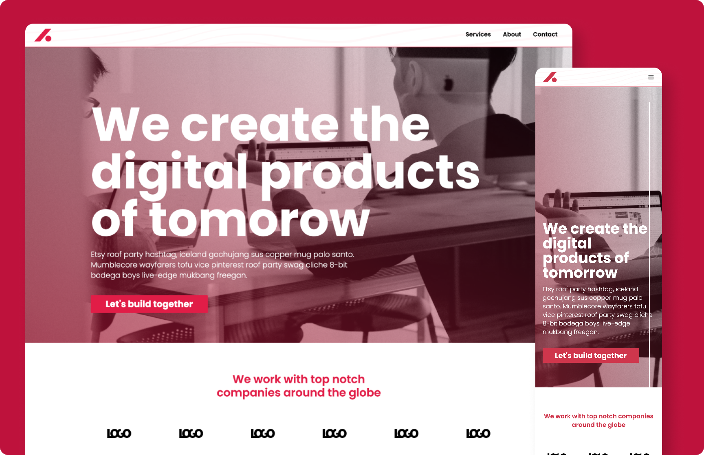

# Svelte Kit Website Template

Multi-page Svelte Kit template for a quick start to your new project.

- Tailwind CSS themable with css custom properties
- Pages for Home, About, Services and Contact
- Several prepared slice components from which you can easily compose new pages
- Contact form with validation. One Version for static pages (default) and one for sending emails from your server (you need to enable some commented code for this)
- Responsive

  

## Developing

```bash
npm run dev

# or start the server and open the app in a new browser tab
npm run dev -- --open
```

## Building

To create a production version of your app:

```bash
npm run build
```

You can preview the production build with `npm run preview`.

> To deploy your app, you may need to install an [adapter](https://kit.svelte.dev/docs/adapters) for your target environment.
